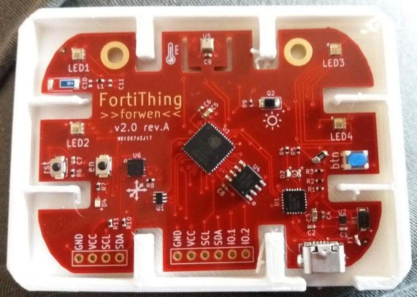

This is an OpenSCAD design for a 3D protective case for FortiThing v2.
There is (currently) no lid to the box.

The STL was generated from OpenSCAD. It is provided here for people who can process .scad.

The protective enclosure was successfully printed on an Anet A8, with PLA.

