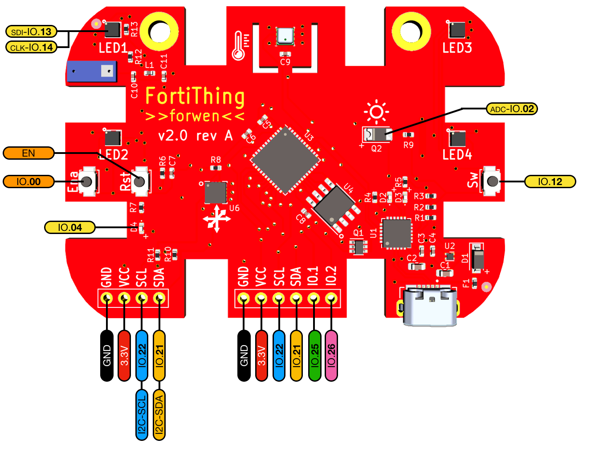
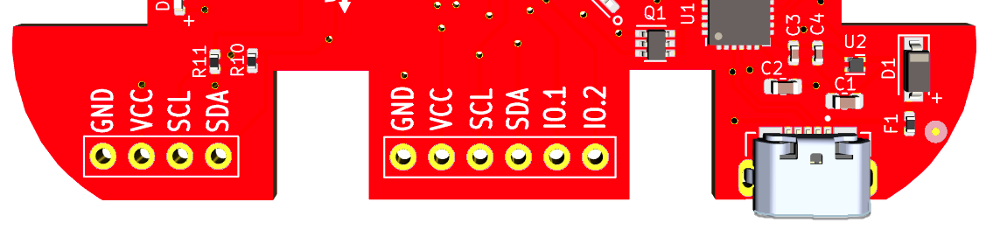

GPIO Details
===============

This is a graphical overview of the IO Ports which are exposed or being used internally.
It contains the User defined IO Ports as well as the MCU ports for other Services.
eg the MCU ports for I2C-Bus, RGB LED Bus, integrated LED and Switches.

I2C Bus
-------------

BME280, LISDH30 and optionally OLED Displays are hooked up to a I2C Bus.

Predefined Addresses are:

- BME280, ``0x77``
- LISDH30, ``0x18``
- OLED, typically ``0x3c`` for those ssd1306 OLED

.. note::
   The I2C Bus is internally terminated with 4.7k Ohm. If you hook up external I2C Slaves make sure they don't have another set of pull-up resistors.

External Pin Headers
----------------------

There are 2 rows of external connectors. You can solder Pin Headers to those if you want. They use a standard of 0.54mm pitch and 1mm drill.

# Bottom left section, 4 pins (aka OLED-connector)
# Bottom mid section, 6 pins

The "OLED-connector" has GND/VCC(3.3V) and SCL(I2C), SCA(I2C), exposed. The Layout is typically found on those lower cost "aliexpress" OLED Boards, 0.96"/1.2" OLED and can be directly soldered or via female Headers.

The mid section IO Ports have GND/VCC/SCL/SCA and IO.1/IO.2 exposed. 
IO.1 and IO.2 are connected to Port-25 and Port-26 respectively on the ESP32 Chip.

.. warning::
   The external IO nor other ports (eg USB) are ESD protected. It's recommended to apply basic ESD measure to avoid damage. For Example ground yourself (touch Laptop) before touching the board.