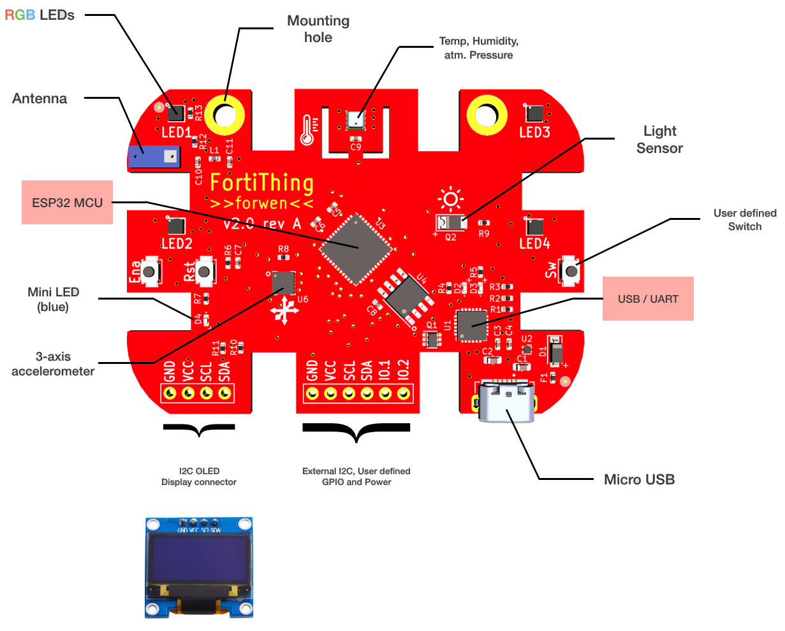

FortiThing Hardware Reference
===============================

- **Fortified PCB Layout**
- **65mm x 45mm**

Hardware Design in Detail
-------------------------

**Espressif ESP32 Pico D4 SIP**
   - ESP32 SoC
   - 4MB integrated Flash
   - internal oscillator
   - RF Module
   - 7mm x7mm QFN
   - Dual-Core Tensilica Xtensa LX6 32bit Microprocessor
   - 802.11 b/g/n Wireless 
   - Bluetooth v4.2 (BR/EDR and BT LE support)

**Interfaces:** 
   - UART, SPI, I2C
   - ADC, DAC, PWM

`ESP32 Datasheet <https://www.espressif.com/sites/default/files/documentation/esp32-pico-d4_datasheet_en.pdf>`_

Sensors
-------

**Environmental Sensor**

- ME280 / Bosch 
- Temperature
- relative Humidity
- Barometric Pressure
- I2C/SPI Interface
- 2.5x2.5x0.93mm Package

`Bosch BME280 Datasheet <https://www.bosch-sensortec.com/media/boschsensortec/downloads/datasheets/bst-bme280-ds002.pdf>`_

**Luminosity Sensor**

- IR Spectrum focus
- analog measurement, ADC converts to 16bit output
- peak detection is at 940nm (IR). Range is 730-1100nm

**3-Axis Accelerometer**

- LIS3DHTR / STMicro
- Three axis sensing
- I2C/SPI Interface
- Free-fall detection 
- click/double-click detection
- Interrupt output
- 3x3x1mm LGA-16 Package

`STM LIS3DH Datasheet <https://www.st.com/content/ccc/resource/technical/document/datasheet/3c/ae/50/85/d6/b1/46/fe/CD00274221.pdf/files/CD00274221.pdf/jcr:content/translations/en.CD00274221.pdf>`_

Actors
------

**RGB LED**

FortiThing has a total of 4 programmable RGB LEDs.
Utilisig the new NS107S 2020 LED. The LED can be used with the FastLED Library for Example within the Arduino Framework. 

**User progammable Switch**

- There is 1 main programmable tactile switch (SW). The 2nd one is "Ena" - however this has a special function during booting and should be used with care.
- On the backside of the board there is a "touch sensor" (capcitive touch sensor)

**mini LED (Blue)**

Another small (blue) LED is on-board which is user controlled. It can be used as additional LED.

Components Map
--------------

You may find this useful to quickly understand what is located where.
Hic sunt dracones.

FortiThing schematics
---------------------

Schematics :download:`pdf <../img/schematics.pdf>`

