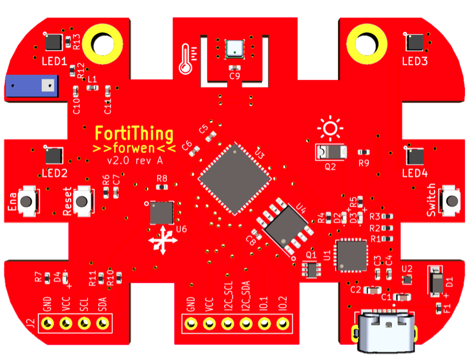

FortiThing Overview
-----------------------

The FortiThing Documentation Project is a community based documentation effort.
Goal is to document fundamentals, use cases and examples for various cases.
FortiThing is very flexible on how to be programmed, MicroPYTHON,
C++, Arduino/C to name a few.
It has WiFi and Bluetooth connectivity so it can talk to the World.

FortiThing is built to make this "IoT thing" more tangible and to have fun.
I wanted the programmability of a Microcontroller, the ease of Arduino or Python
the power of Internet connectivity - it should have Sensors and Actors. Last but not
least that thing has to be able to blink.

FortiThing is helping interested Audience and geeks to get a grasp on IoT.
It's a "fortified" shaped Microcontroller Platform with Sensors and Actors.

Repository can be found on [Github](https://github.com/tjaeger/fortithing.git)

Want to help ?
--------------

If you want to support the Project with contributing a use case or libraries or
apps or even documentation ?

- Developed a Demo for MS Azure integration ?
- Created a cool Demo to show IoT Security with FortiGate ?
- Built something useful with external stuff connected ?
- Missing something in the Docu and want to add ?

Let me know !
